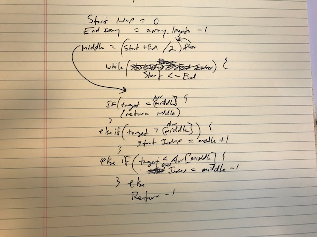

# Reverse an Array
Third code challenge of Career Track

## Challenge
Write a function that is passed a sorted array and a search key return index of array's element that is equal to search key... without using any built in methodology.

## Approach & Efficiency 
At first I thought a for loop, but the problem with that is you have to iterate through the entire array. Then I fell upon (looked up/asked about) divide and conquer method where you are always checking the mid point and changing the start or end index depending on if the key is higher or lower than the mid point (only works with a sorted array obviously).

## Solution
