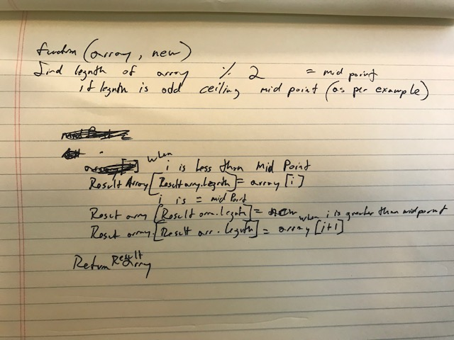

# Challenge Summary
Second Code Challenge of Career track

## Challenge Description
Write a function which takes in an array and the value to be added, and inserts the new value added at the middle index, without the use of any built in methods/

## Approach & Efficiency
<!-- What approach did you take? Why? What is the Big O space/time for this approach? -->

## Solution
