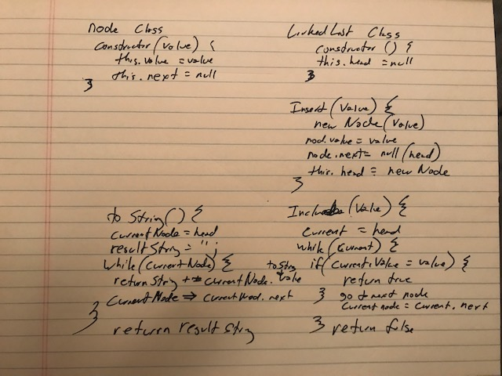

# Challenge Summary
Fifth Code Challenge of Career track

## Challenge Description
Write a node class that has properties for stored value in the Node and a pointer to the next node.
Upon instantiation, an empty Linked List needs to be created.
Define a method called insert
Define a method called includes
Define a method called toString

## Stretch
Write a method to delete a node with valuse

## Approach & Efficiency
Create a Node Class
with this.value equal to value passed in
and this.next = null... the first and the last!

Create a LinkedList class
this.head = null

write an insert that takes a value and will add a new Node instance to list.
the next becomes null and the the head become the new node.

includes takes a value as a parameter, traverse the list and look for the .value. if that equals the value passed in, return true!

toString, traverse list and collect all the .values in a string.

## Solution
