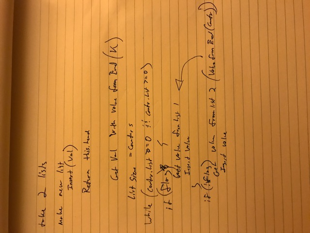

# Challenge Summary
Eighth Code Challenge of Career track

## Challenge Description
Write a function called mergeLists which takes two linked lists as arguments, zips the two linked lists together so that the nodes alternate between the two lists and returns a reference to the head of the zipped list.

## Approach & Efficiency
get a counter from each list based on list.size
while loop through counter
have  flag to change which list to work with
get value from end based on counter
insert value
need options for if lists are of varying lengths

## Solution
