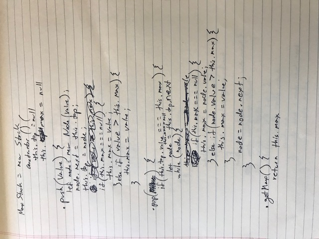

# Challenge Summary
Class 14 Code Challenge of Career track - Question One: GetMax!

## Challenge Description
Write a method called getMax that returns the 'biggest' element in the stack

## Approach & Efficiency
get a counter from each list based on list.size
while loop through counter
have  flag to change which list to work with
get value from end based on counter
insert value
need options for if lists are of varying lengths

## Solution
