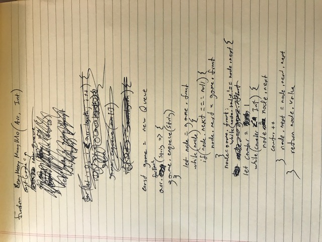

# Challenge Summary
Class 14 Code Challenge of Career track - Question One: GetMax!

## Challenge Description
Write a fucntion called EeneyMeeneyMineyMoe() that accepts a list of strings and an int k. Start at the beggining of the list and count up to k and remove the person at that index from the list. Leep counting from that index and count up to k over and over until only one person is left in the list. Return a string with the name of the last person left.

## Approach & Efficiency
make a new queue
enqueue each string
if node.next === null, node.next = game.front
loop through while node.next !== node.value

this method assumes each input is unique

## Solution
