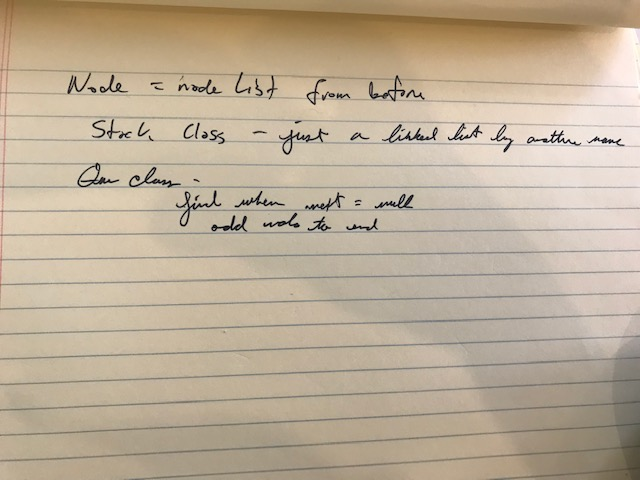

# Challenge Summary
Tenth Code Challenge of Career track

## Challenge Description
* Create a Node class that has properties for the value stored in the Node, and a pointer to the next node.

* Create a Stack class that has a top property. It creates an empty Stack when instantiated.

    * This object should be aware of a default empty value assigned to top when the stack is created.

    * Define a method called push which takes any value as an argument and adds a new node with that value to the top of the stack with an O(1) Time performance.

    * Define a method called pop that does not take any argument, removes the node from the top of the stack, and returns the node’s value.

    * Define a method called peek that does not take an argument and returns the value of the node located on top of the stack, without removing it from the stack.

* Create a Queue class that has a front property. It creates an empty Queue when instantiated.

    * This object should be aware of a default empty value assigned to front when the queue is created.

    * Define a method called enqueue which takes any value as an argument and adds a new node with that value to the back of the queue with an O(1) Time performance.

    * Define a method called dequeue that does not take any argument, removes the node from the front of the queue, and returns the node’s value.

    * Define a method called peek that does not take an argument and returns the value of the node located in the front of the queue, without removing it from the queue.

## Approach & Efficiency
* Node is the same as Node class from before.
* Stack has this.top
  *  push is roughly the same as insert
  * pop: 
    1. find this.top
    2. set this.top to next
    3. return node
  * peek: find this.top, return value
* Queue has a this.front
  * enqueue
    1. create new node
    2. if there is no front, node becomes front
    3. iterate through the list, find .next=null
    4. set tail.next = node
  * dequeue is the same as stack.pop
  * peek is the same as stack.peek

## Solution
